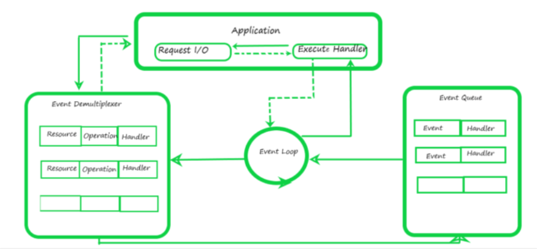

## Node JS Arquitetura

### Como o nodejs trabalha com I/O

NodeJS é um é ambiente de execução que nos permite rodar Javascript fora dos browsers foi amplamente adotada pela comunidade e mercado.

Assim como já é o Javascript em browser, o NodeJS trabalha asyncrono, realiza a chamada de uma tarefa e sem esperar resposta ele já realiza a proxima.

Exemplo:

```
const fs = require('fs');

console.log("1. Vou começar a ler o ficheiro...");

// Exemplo de I/O Não Bloqueante (Assíncrono)
fs.readFile('exemplo.txt', 'utf8', (err, data) => {
    if (err) return;
    console.log("3. Conteúdo do ficheiro lido!");
});

console.log("2. Já passei pela leitura e continuei o código!");
```

Resultado:

1. Comecei agora!
2. Já cheguei no fim do ficheiro!
3. Só apareci depois que tudo terminou.

### Reactor Pattern

Sabendo que o nodejs é não bloqueante por natureza, e o Reactor Pattern é conhecido para evitar bloquear I/O.

### Demultiplexer

O JS V8 usa o Demultiplexer para conseguir acessar I/O, in-network, arquivos, mas ele é muito mais que isso, na verdade bem complexo o seu funcionamento, mas para entender esse artigo a unica informação obrigatoria é que ele permite o JS acessar I/O Asyncrono.

1 - Começando quando a aplicação inicia uma requisição de I/O (Ler um arquivo da maquina por exemplo)

2 - Essa requisição é recebida pelo [Demultiplexer](https://www.geeksforgeeks.org/electronics-engineering/what-is-demultiplexerdemux/) ele fica responsavel por enfileirar as requisições em uma fila de eventos

3 - Essa requisição entra em um event loop usado pela fila de eventos aguardando resposta ou timeout uma vez obtendo seu resultado ele é enviado para a aplicação atraves do Execute Handler



Fontes:

[What is Reactor Pattern in Node.js ?](https://www.geeksforgeeks.org/node-js/what-is-reactor-pattern-in-node-js/)

[What is Demultiplexer(DEMUX)?](https://www.geeksforgeeks.org/electronics-engineering/what-is-demultiplexerdemux/)

[Difference between Multiplexer and Demultiplexer](https://www.geeksforgeeks.org/gate/difference-between-multiplexer-and-demultiplexer/)

[The Proactor and Reactor Design Patterns](https://www.youtube.com/watch?v=Vm5l8zH4hOE)
